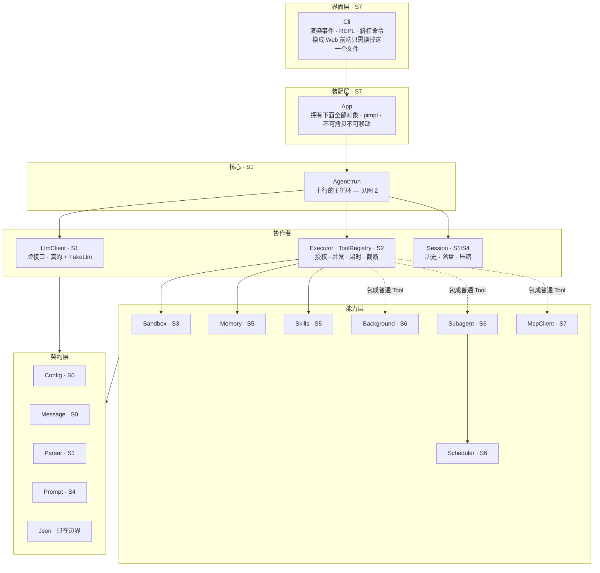
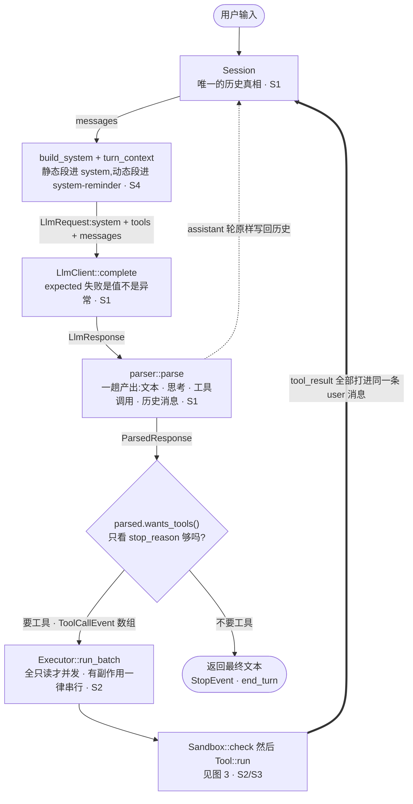
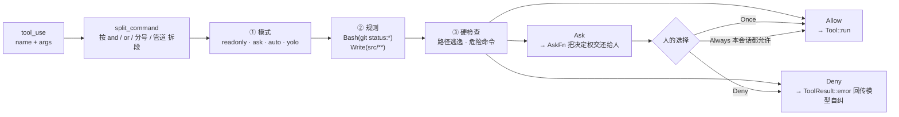

# 结构图纸

五张图。第 2 张是心脏,其余四张分别画出它周围的四件事:谁依赖谁、权限在哪里拦、
上下文预算怎么花、以及 C++ 特有的所有权与构造顺序。

配套阅读:`BUILD-GUIDE.md` 讲**怎么建**,这份讲**建成什么样**。

> 图里的 `S0`–`S7` 是实现阶段。想知道某一块什么时候写,看阶段标记。

---

## 图 1 · 分层与依赖方向

**依赖只向下。`Agent` 只认识三个协作者,其余全是被它们借用的能力。**



那三条虚线是 `Tool` 抽象的回报:**后台任务、子 agent、MCP 远程工具最终都是同一个形状**,
`Executor` 和 `Sandbox` 分不出哪个是远程的。这就是"抽象设计对一次,后面五个阶段都在复用"。

---

## 图 2 · 一轮循环的数据流

**整个项目的心脏。两条回边把它变成循环 —— 一条写回 assistant 轮,一条写回工具结果。**



**粗边是循环闭合的那条**。两条回边都不能省:

| 回边 | 规则 | 违反的后果 |
|---|---|---|
| 工具结果(粗) | 一轮里所有 `tool_result` 打进**同一条** user 消息 | 拆开会让模型逐渐学会不再并行调工具 |
| assistant 轮(虚) | 原样回传,包括 `thinking` 和 `signature` | 每个 `tool_use` 少一个配对的 `tool_result` → 下一轮请求直接 400 |

对应测试:`loop_runs_tool_then_answers`、`all_tool_results_in_one_message`、
`max_steps_guard`、`tool_error_becomes_result_not_crash`。

---

## 图 3 · 权限闸门

**工具自己不做权限判断。`Executor` 在调用前统一问这一层,三态而非布尔。**



三道关卡**串联**:任一拒绝即拒绝。

`split_command` 画在关卡之前是有原因的 —— `git status && rm -rf /`
**整条看是安全的、拆开才不是**。这一步不做,后面全白搭
(测试 `command_is_split_before_checking`)。

`Ask` 是三态里最重要的那个:设计成 `bool`,后面加交互确认要整层重写。

> **待定**:`asker` 为空(CI、子 agent)时 `Ask` 该退化成什么?见 `sandbox.hpp:53`。

---

## 图 4 · 上下文预算

**缓存断点把请求切成两半:前半必须逐字节稳定,后半允许每轮变化。**

```text
       静态：逐字节稳定 → 每轮命中缓存             动态：每轮都变
  |------------------------------------------|  ||  |----------------|

  +--------+--------+----------+-------+------+  ||  +--------+------+
  | tools  |identity|tool guide| skill |memory|  ||  |messages|remind|
  | 已排序 | 身份段 | 使用要点 | 索引  | 索引 |  ||  | 对话   | 时间 |
  +--------+--------+----------+-------+------+  ||  +--------+------+
                                                 ^^
                                          cache_breakpoint
```

**断点之前混进一个时间戳或 uuid → 它后面的一切(也就是整段对话)每轮全额重新计费。**

所以划一条线:

| 内容 | 去哪 |
|---|---|
| 身份、工具用法、skill/memory 索引、工作区路径 | `system`,最后一块打缓存断点 |
| 当前时间、后台任务通知、todo 变化 | user 轮的 `<system-reminder>` 块 |

工具表排在最前面,**顺序一变整个缓存前缀就废了** —— 这就是 `tool_schemas_are_sorted` 存在的理由。

### 渐进式披露 — memory 与 skills 共用的一招


只有**索引**住在缓存断点之前(常驻上下文),正文和附件都在断点之后按需加载。

另外两条省法:

- **压缩**:超过 `compact_at_tokens` 时在 **user 边界**切分,老历史换成纪要。
  切在 `tool_result` 中间会留下没配对的 `tool_use`(测试 `compaction_splits_on_user_boundary`)。
- **子 agent**:它读两万行,主 agent 只收 300 字结论,主循环的断点前缀完全没动。
  **价值是上下文隔离,不是并行。**

---

## 图 5 · 所有权与构造顺序

**成员按声明顺序构造、按逆序析构。被指向的必须在前面,`agent` 必须最后。**

这十一个成员住在 `App::Impl` 里(`src/app.cpp`),不在头文件里:

```text
声明顺序 = 构造顺序（析构逆序）

   1  Config cfg                     *
   2  unique_ptr<LlmClient> llm
   3  Sandbox sandbox                *
   4  BackgroundManager background   *
   5  Memory memory                  *
   6  SkillRegistry skills           *
   7  McpClient mcp
   8  ToolRegistry registry          *
   9  Session session                *
  10  ToolContext ctx                    <-- 非拥有裸指针，指向所有带 * 的成员
  11  Agent agent                        <-- 持有 ctx 的引用；必须最后声明
```

`ToolContext` 是一个**借来的引用包** —— 它不拥有任何东西,只记住那七个成员在哪。
所以它们必须**先**构造完毕,而 `Agent` 又持有 `ctx` 的引用,只能排在最后。
把 `agent` 写到别处,构造它时拿到的就是还没初始化的对象。

三条红线:

- **这类顺序 bug 只在 release 构建下偶尔炸。** 本项目默认构建类型正是 `RelWithDebInfo`。
- **`App` 显式 `delete` 了拷贝与移动** —— 移动只会留下一个 `impl_` 为空的壳。
- **析构函数必须定义在 `.cpp` 里**(`app.cpp:20`)。写在头文件里,那个位置 `Impl`
  还是不完整类型,`unique_ptr` 没法删除它。

`pimpl` 在这里换来两样东西:顺序声明和构造函数挨在同一个文件、调整顺序不引起全项目重编译。
它顺带还让 `Impl` 待在堆上一动不动,那些裸指针天然保持有效。

---

## 图纸看不出来的四条纪律

**1. 封闭集合用 `variant`,开放集合用虚函数。**
content block 和事件由 API 定死 → `variant`,加一种时所有 `std::visit` 都编译报错;
`Tool` 和 `LlmClient` 用户随时会加 → 虚函数。

**2. 失败是值,不是异常。**
`expected<LlmResponse, LlmError>` 让 429 能重试;`ToolResult::is_error`
让读不到一个文件不会崩掉整个任务。判据:调用方有没有可能"处理"这个失败?

**3. 能切掉 LLM 依赖的层就切掉。**
`Scheduler` 只认识 `runner(task, upstream)`,测试塞一个 lambda 就能验证拓扑序和环检测,
不烧一分钱。`FakeLlm` 是同一招用在 `LlmClient` 上 —— 15 个测试因此全部离线、一秒跑完。

**4. 生命周期契约只能写在注释里。**
`FakeLlm` 持有 `const Config&`、`ToolContext` 全是裸指针 ——
**「你必须活得比我久」这件事 C++ 无法表达,也无法检查。**
唯一的防线是注释 + 声明顺序,兜底手段是 `-fsanitize=address`。

---

## 阶段 · 文件 · 验收对照

| 阶段 | 文件 | 结束时你拥有 |
|---|---|---|
| S0 | `config` `message` | 一套贯穿全局的类型 |
| S1 | `llm` `parser` `session` `loop` | **一个真能干活的 agent** |
| S2 | `tool` `executor` `process` `tools/builtin` | 完整工具层 + 并发执行 |
| S3 | `sandbox` | 权限闸门,敢在真项目上跑 |
| S4 | `prompt` + `session::compact` | 缓存友好 + 长任务不爆 |
| S5 | `memory` `skills` | 跨会话记忆 + 技能插件 |
| S6 | `subagent` `scheduler` `background` | 多 agent + 任务图 + 后台任务 |
| S7 | `mcp` `app` `cli` | 接外部工具 + 能用的界面 |

```bash
cmake --build build && ./build/test_smoke     # 开发循环就这一行
```
